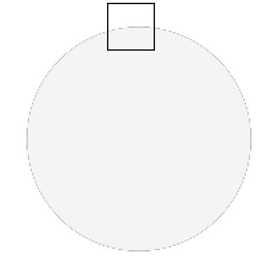
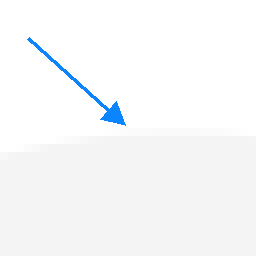
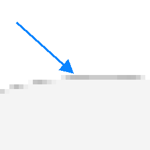

# Magick.Native.RegressionTest

I've had an issue with fine lines on edges of composited graphics in Magick.NET versions past 14.10.3. The issue manifests
when multiplying with partially transparent pixels. This repo has a test demonstrating the issue.

Since ImageMagick 7.1.2-16 (Magick.NET 14.10.4), `CompositeOperator.Multiply` leaves partly transparent results too
dark: their stored colour is multiplied by their alpha. Composited `Over` a background, those pixels show as a dark line
along the edge.

I forked [Magick.Native](https://github.com/schnoberts1/Magick.Native) and created the branch
[multiply-gamma](https://github.com/schnoberts1/Magick.Native/tree/multiply-gamma) off tag `2026.904.721`, which
Magick.NET 14.17.1 uses. Its workflow builds the native library and runs this test. The test
[fails](https://github.com/schnoberts1/Magick.Native/actions/runs/35722993455) for the above reasons.

I branched [fix-multiply-gamma](https://github.com/schnoberts1/Magick.Native/tree/fix-multiply-gamma) off
multiply-gamma to restore `gamma` in `Multiply`, and the test
[passes](https://github.com/schnoberts1/Magick.Native/actions/runs/35722993245). I do not know if this is the _right_
fix, but it fixes the output for my scenario.

I have only tested macOS arm64.

## Results

`expected/disc.png` is the output of 14.10.3. It matches the
[W3C compositing formula](https://www.w3.org/TR/compositing-1/#generalformula) at every pixel.

I did work through the versions to see if a fix had come and gone but this is not the case.

| Magick.NET | ImageMagick | Result |
|---|---|---|
| 14.10.3 | 7.1.2-15 | PASS |
| 14.10.4 to 14.11.1 | 7.1.2-16 to 7.1.2-18 | FAIL |
| 14.12.0 to 14.17.1 | 7.1.2-19 to 7.1.2-31 | FAIL |

| Magick.NET 14.10.3 | Magick.NET 14.17.1 |
|---|---|
|  |  |
|  |  |

Top: the disc at 2×. Bottom: the boxed area at 8×. The arrow marks x=94 y=19: 251 on 14.10.3, 189 on 14.17.1.

## Cause

ImageMagick commit [49e5a11](https://github.com/ImageMagick/ImageMagick/commit/49e5a11140d4b837475d4d21ce993d33f3558f12)
(issue [#8579](https://github.com/ImageMagick/ImageMagick/issues/8579)), first released in 7.1.2-16, removed `gamma`
from the `Multiply` colour in `MagickCore/composite.c`:

```diff
-            pixel=(double) QuantumRange*gamma*(Sca*Dca+Sca*(1.0-Da)+Dca*
-              (1.0-Sa));
+            pixel=(double) QuantumRange*(Sca*Dca+Sca*(1.0-Da)+Dca*(1.0-Sa));
```

`gamma` is 1 ÷ the result alpha
([2415](https://github.com/ImageMagick/ImageMagick/blob/7.1.2-31/MagickCore/composite.c#L2415),
[2734](https://github.com/ImageMagick/ImageMagick/blob/7.1.2-31/MagickCore/composite.c#L2734)), so the colour is no
longer divided by alpha. The line is unchanged on `main` as of 2026-09-22.

The same commit made `CopyAlpha` read the source's intensity instead of its alpha.
[43e4dbf](https://github.com/ImageMagick/ImageMagick/commit/43e4dbfc7a80dac4adeeae4999a757746ec25ab2) restored it in
7.1.2-19 (Magick.NET 14.12.0). 14.10.4 to 14.11.1 therefore render the whole image grey.

## Run

See the [workflow](https://github.com/schnoberts1/Magick.Native/blob/multiply-gamma/.github/workflows/macos-q8-arm64.yml).
Its build without the patch was byte-identical to the NuGet package's library.
